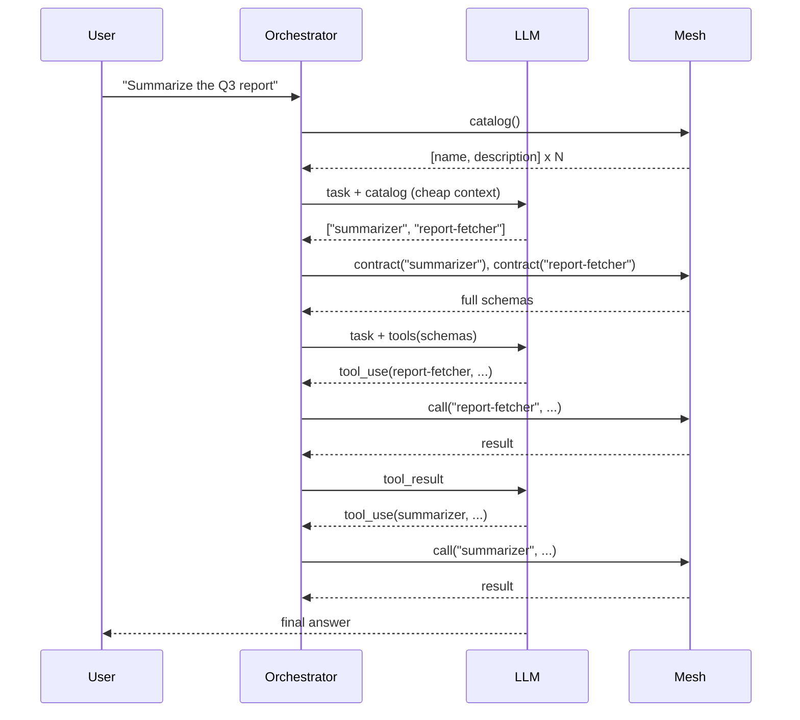

# LLM-Driven Tool Selection

An orchestrator agent receives a task in natural language, browses the mesh catalog, selects which agents fit, fetches their full contracts, and calls them as tools. No hardcoded tool list. New agents on the mesh become callable the moment they register.

This is the **enterprise tool search** pattern: instead of pre-wiring every tool a model can call, the orchestrator discovers them at runtime. The two-tier catalog keeps token cost flat even with hundreds of agents on the mesh.

## The Code

```python
--8<-- "src/openagentmesh/demos/llm_tool_selection.py"
```

!!! note
    The demo simulates LLM selection with keyword matching. In production, replace the selection logic with an actual LLM call (see the full pattern below).

## Run It

```bash
oam demo run llm_tool_selection
```

## Pattern



## Why Two Tiers

A single-tier approach (load every contract into the LLM context) breaks down past a few dozen agents:

| Approach | Tokens for selection | Tokens for execution |
|----------|---------------------|---------------------|
| All contracts upfront | ~500 per agent x N | ~500 per agent x N |
| Catalog then contract | ~25 per agent x N | ~500 per **selected** agent |

For a mesh with 200 agents and 3 selected per task, the two-tier approach cuts selection cost roughly **20x** and keeps execution context small enough for the model to focus.

## Production Orchestrator

Replace the simulated selection with a real LLM call:

```python
from anthropic import AsyncAnthropic

client = AsyncAnthropic()

# Tier 1: ask the LLM which agents to use
catalog = await mesh.catalog()
catalog_text = "\n".join(f"- {e.name}: {e.description}" for e in catalog if e.invocable)

selection = await client.messages.create(
    model="claude-sonnet-4-6",
    max_tokens=512,
    messages=[{
        "role": "user",
        "content": (
            f"Available agents:\n{catalog_text}\n\n"
            f"Task: {req.task}\n\n"
            "Reply with a JSON array of agent names useful for this task."
        ),
    }],
)
names = json.loads(selection.content[0].text)

# Tier 2: fetch full contracts and expose as tools
tools = []
for name in names:
    contract = await mesh.contract(name)
    tools.append(contract.to_anthropic_tool())
```

## Variants

- **RAG over the catalog.** Replace the LLM selection turn with embedding-based retrieval over `name + description + tags`.
- **Channel pre-filter.** Narrow with `mesh.catalog(channel="finance")` before LLM selection when the task domain is known.
- **Streaming tools.** Swap `mesh.call()` for `mesh.stream()` when a selected agent is streaming-capable.
