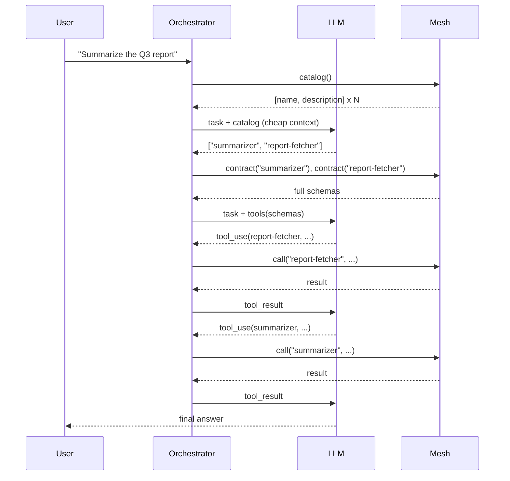

# LLM-Driven Tool Selection

An orchestrator agent receives a task in natural language, browses the mesh catalog, asks an LLM which agents fit, fetches their full contracts, and exposes them as tools to the LLM in a second turn. No hardcoded tool list. New agents on the mesh become callable the moment they register.

This is the **enterprise tool search** pattern: instead of pre-wiring every tool a model can call, the orchestrator discovers them at runtime. The two-tier catalog keeps token cost flat even with hundreds of agents on the mesh.

## Pattern



## Models

```python
from pydantic import BaseModel

class TaskRequest(BaseModel):
    task: str

class TaskResponse(BaseModel):
    answer: str
```

## Orchestrator Agent

The orchestrator is itself a mesh agent. It uses two LLM turns: a cheap selection turn (catalog only) and an execution turn (full schemas as tools).

```python
import json

from anthropic import AsyncAnthropic
from openagentmesh import AgentMesh, AgentSpec

mesh = AgentMesh()
client = AsyncAnthropic()

spec = AgentSpec(
    name="orchestrator",
    description="Solves natural-language tasks by selecting and calling other agents on the mesh.",
)

@mesh.agent(spec)
async def orchestrator(req: TaskRequest) -> TaskResponse:
    # Tier 1: cheap selection over the catalog
    catalog = await mesh.catalog()
    catalog_text = "\n".join(f"- {e.name}: {e.description}" for e in catalog if e.invocable)

    selection = await client.messages.create(
        model="claude-sonnet-4-6",
        max_tokens=512,
        messages=[{
            "role": "user",
            "content": (
                f"Available agents:\n{catalog_text}\n\n"
                f"Task: {req.task}\n\n"
                "Reply with a JSON array of agent names that are useful for this task."
            ),
        }],
    )
    names = json.loads(selection.content[0].text)

    # Tier 2: fetch full contracts only for the selected agents
    tools = []
    for name in names:
        contract = await mesh.contract(name)
        tools.append({
            "name": contract.name,
            "description": contract.description,
            "input_schema": contract.input_schema,
        })

    # Execution turn: LLM decides which tool(s) to call
    messages = [{"role": "user", "content": req.task}]
    while True:
        resp = await client.messages.create(
            model="claude-sonnet-4-6",
            max_tokens=2048,
            tools=tools,
            messages=messages,
        )
        if resp.stop_reason == "end_turn":
            text = next(b.text for b in resp.content if b.type == "text")
            return TaskResponse(answer=text)

        messages.append({"role": "assistant", "content": resp.content})
        tool_results = []
        for block in resp.content:
            if block.type == "tool_use":
                output = await mesh.call(block.name, block.input)
                tool_results.append({
                    "type": "tool_result",
                    "tool_use_id": block.id,
                    "content": json.dumps(output),
                })
        messages.append({"role": "user", "content": tool_results})
```

## Why two tiers

A single-tier approach (load every contract into the LLM context) breaks down past a few dozen agents:

| Approach | Tokens for selection | Tokens for execution |
|----------|---------------------|---------------------|
| All contracts upfront | ~500 per agent x N | ~500 per agent x N |
| Catalog then contract | ~25 per agent x N | ~500 per **selected** agent |

For a mesh with 200 agents and 3 selected per task, the two-tier approach cuts selection cost roughly **20x** and keeps execution context small enough for the model to focus.

For very large meshes (~1000+ agents), pair the catalog with a vector index over `description` and `tags`. The catalog is the source of truth; the index is only a recall accelerator.

## Variants

- **RAG over the catalog.** Replace the LLM selection turn with embedding-based retrieval over `name + description + tags`.
- **Channel pre-filter.** Narrow with `mesh.catalog(channel="finance")` before LLM selection when the task domain is known.
- **Streaming tools.** Swap `mesh.call()` for `mesh.stream()` when a selected agent is streaming-capable; the LLM SDK's tool result loop handles incremental updates.

## Run It

Start the mesh and a few provider agents (see [Multi-Process Agents](multi-process.md)), then run the orchestrator and call it like any other agent:

```bash
oam mesh up
python providers.py &        # registers summarizer, report-fetcher, etc.
python orchestrator.py &
oam agent call orchestrator '{"task": "Summarize the Q3 report"}'
```

The orchestrator never imported the providers. They could live in another repo, another team, another language.
