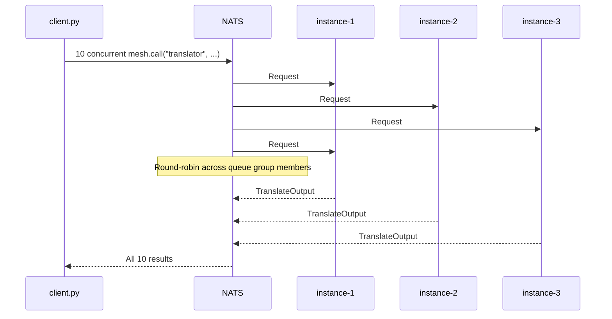

# Automatic Load Balancing

Run multiple instances of the same agent. Requests spread across them automatically. No configuration, no service discovery, no load balancer. NATS queue groups handle it.

This recipe demonstrates the zero-config scaling story: you scale by running more copies.

## The Agent

A translation agent with a deliberate delay to make load distribution visible:

```python
import asyncio
import os
from pydantic import BaseModel
from openagentmesh import AgentMesh, AgentSpec

mesh = AgentMesh()

INSTANCE = os.getenv("INSTANCE", "1")

class TranslateInput(BaseModel):
    text: str
    target_language: str = "es"

class TranslateOutput(BaseModel):
    translated: str
    handled_by: str

spec = AgentSpec(
    name="translator",
    channel="nlp",
    description="Translates text to a target language. Input: text and target_language code.",
)

@mesh.agent(spec)
async def translate(req: TranslateInput) -> TranslateOutput:
    await asyncio.sleep(0.5)  # simulate LLM call
    return TranslateOutput(
        translated=f"[{req.target_language}] {req.text}",
        handled_by=f"instance-{INSTANCE}",
    )

mesh.run()
```

## The Client

Fires 10 concurrent requests and reports which instance handled each:

```python
import asyncio
from openagentmesh import AgentMesh

async def main():
    mesh = AgentMesh()
    async with mesh:
        # Fire 10 requests concurrently
        tasks = [
            mesh.call("translator", {"text": f"Hello #{i}", "target_language": "es"})
            for i in range(10)
        ]
        results = await asyncio.gather(*tasks)

        for i, result in enumerate(results):
            print(f"Request #{i}: handled by {result['handled_by']}")

        # Show distribution
        instances = [r["handled_by"] for r in results]
        for instance in sorted(set(instances)):
            count = instances.count(instance)
            print(f"  {instance}: {count} requests")

asyncio.run(main())
```

## Run It

Start NATS, then three instances of the same agent:

```bash
# Terminal 1
oam mesh up

# Terminals 2-4: three copies of the same agent
INSTANCE=1 python translator.py
INSTANCE=2 python translator.py
INSTANCE=3 python translator.py

# Terminal 5
python client.py
```

Output:

```
Request #0: handled by instance-2
Request #1: handled by instance-1
Request #2: handled by instance-3
Request #3: handled by instance-1
Request #4: handled by instance-2
Request #5: handled by instance-3
Request #6: handled by instance-2
Request #7: handled by instance-1
Request #8: handled by instance-3
Request #9: handled by instance-1
  instance-1: 4 requests
  instance-2: 3 requests
  instance-3: 3 requests
```

## How It Works

Every `@mesh.agent` subscription uses a NATS queue group named after the agent. When multiple processes register the same agent name, NATS treats them as members of the same group and distributes messages round-robin across the group.



Key properties:

- **No registration changes.** Each instance registers the same agent name and contract. The catalog shows one agent, not three.
- **No client changes.** `mesh.call("translator", ...)` is identical whether one or fifty instances are running.
- **Automatic rebalancing.** Kill an instance and its share redistributes instantly. Start a new one and it joins the group.
- **Per-message, not per-connection.** Unlike HTTP load balancers, each individual request is routed independently. No sticky sessions, no connection draining.
