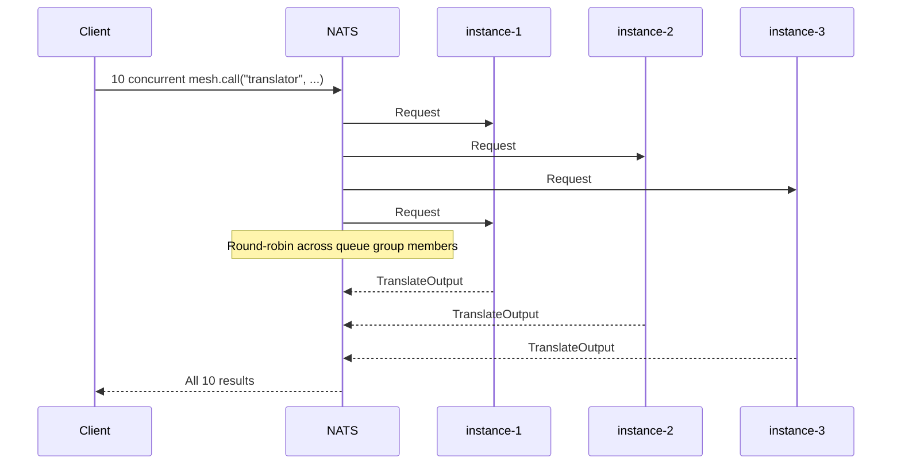

# Automatic Load Balancing

Run multiple instances of the same agent. Requests spread across them automatically. No configuration, no service discovery, no load balancer. NATS queue groups handle it.

This recipe demonstrates the zero-config scaling story: you scale by running more copies.

## The Code

```python
import asyncio

from pydantic import BaseModel

from openagentmesh import AgentMesh, AgentSpec


class TranslateInput(BaseModel):
    text: str
    target_language: str = "es"


class TranslateOutput(BaseModel):
    translated: str
    handled_by: str


async def main(mesh: AgentMesh) -> None:
    instance_counter = {"n": 0}

    @mesh.agent(AgentSpec(name="translator", channel="nlp", description="Translates text to a target language."))
    async def translate(req: TranslateInput) -> TranslateOutput:
        instance_counter["n"] += 1
        instance_id = instance_counter["n"]
        await asyncio.sleep(0.05)
        return TranslateOutput(
            translated=f"[{req.target_language}] {req.text}",
            handled_by=f"instance-{instance_id}",
        )

    # Fire 10 concurrent requests
    tasks = [
        mesh.call("translator", TranslateInput(text=f"Hello #{i}", target_language="es"))
        for i in range(10)
    ]
    results = await asyncio.gather(*tasks)

    for i, result in enumerate(results):
        print(f"Request #{i}: handled by {result['handled_by']}")
```

## Run It

```bash
oam demo run load_balancing
```

## How It Works

Every `@mesh.agent` subscription uses a NATS queue group named after the agent. When multiple processes register the same agent name, NATS treats them as members of the same group and distributes messages round-robin across the group.



Key properties:

- **No registration changes.** Each instance registers the same agent name and contract. The catalog shows one agent, not three.
- **No client changes.** `mesh.call("translator", ...)` is identical whether one or fifty instances are running.
- **Automatic rebalancing.** Kill an instance and its share redistributes instantly. Start a new one and it joins the group.
- **Per-message, not per-connection.** Unlike HTTP load balancers, each individual request is routed independently. No sticky sessions, no connection draining.
