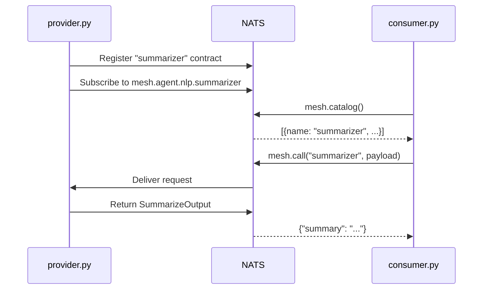

# Multi-Process Agents

The most common deployment: one process provides an agent, another discovers and calls it. No shared imports, no shared memory -- just NATS.

## Provider

**provider.py** -- registers a summarizer agent and blocks:

```python
from pydantic import BaseModel
from openagentmesh import AgentMesh

mesh = AgentMesh.local()

class SummarizeInput(BaseModel):
    text: str
    max_length: int = 200

class SummarizeOutput(BaseModel):
    summary: str

@mesh.agent(
    name="summarizer",
    channel="nlp",
    description="Summarizes text to a target length. Input: raw text and optional max_length. Not for structured data extraction.",
)
async def summarize(req: SummarizeInput) -> SummarizeOutput:
    # Your logic here -- call an LLM, run extractive summarization, anything.
    truncated = req.text[: req.max_length]
    return SummarizeOutput(summary=truncated)

mesh.run()  # blocks, like uvicorn.run()
```

## Consumer

**consumer.py** -- discovers agents on the mesh and calls one:

```python
import asyncio
from openagentmesh import AgentMesh

async def main():
    mesh = AgentMesh.local()
    await mesh.start()

    # Browse the mesh
    catalog = await mesh.catalog()
    for entry in catalog:
        print(f"{entry['name']} - {entry['description']}")

    # Call by name
    result = await mesh.call(
        "summarizer",
        {"text": "AgentMesh connects agents over NATS. Agents register, discover, and invoke each other at runtime.", "max_length": 40},
    )
    print(result["summary"])

    await mesh.stop()

asyncio.run(main())
```

## Run It

Start the provider first, then the consumer in a second terminal:

```bash
# Terminal 1
python provider.py

# Terminal 2
python consumer.py
```

Output:

```
summarizer - Summarizes text to a target length. Input: raw text and optional max_length. Not for structured data extraction.
AgentMesh connects agents over NATS. Ag
```

## How It Works

Both processes call `AgentMesh.local()`, which connects to the same embedded NATS server. The provider registers its contract (name, schema, description) in the mesh registry. The consumer reads the catalog and invokes the agent by name -- no import of the provider's code required.



## Moving to Shared NATS

Replace `AgentMesh.local()` with a connection string in both files. Nothing else changes.

```python
mesh = AgentMesh("nats://mesh.company.com:4222")
```

`AgentMesh.local()` is for development. In production, point both processes at the same NATS cluster.
