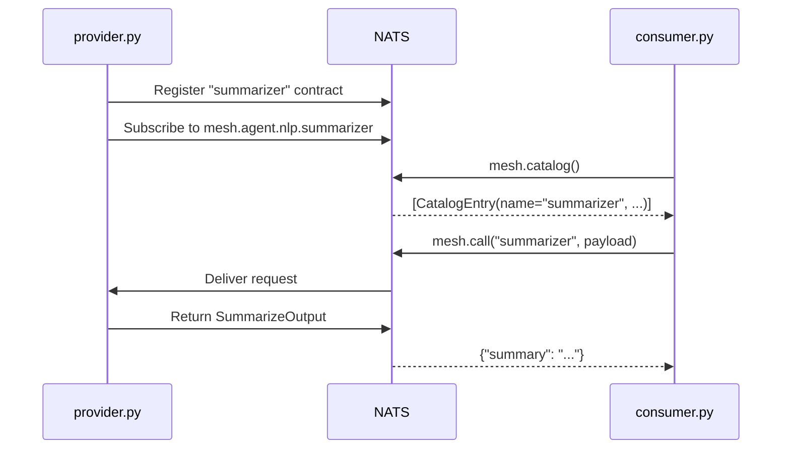

# Multi-Process Agents

The most common deployment: one process provides an agent, another discovers and calls it. No shared imports, no shared memory. Just NATS.

This recipe is the canonical pairing of the [Provider and Consumer participation patterns](../concepts/participation.md), each in its own process.

## The Code

```python
--8<-- "src/openagentmesh/demos/multi_agent.py"
```

The demo registers a summarizer agent and then acts as a consumer: browsing the catalog and calling the agent by name. In production, these would be separate processes connecting to the same mesh.

## Run It

```bash
oam demo run multi_agent
```

## How It Works



Key properties:

- **No shared imports.** The consumer never imports the provider's code. It discovers agents at runtime through the catalog.
- **Same connection string, different processes.** `AgentMesh()` connects to `nats://localhost:4222` by default. In production, pass the connection string for your shared NATS cluster.
- **`async with mesh:` for consumers.** Scripts, notebooks, and CLI tools that only call agents use `async with mesh:` instead of `mesh.run()`.
