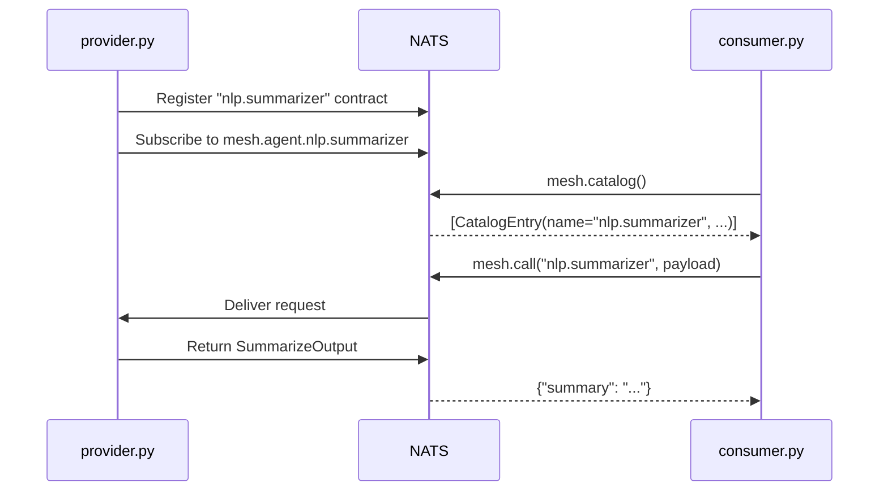

# Multi-Process Agents

The most common deployment: one process provides an agent, another discovers and calls it. No shared imports, no shared memory. Just NATS.

This recipe is the canonical pairing of the [Provider and Consumer participation patterns](../concepts/participation.md), each in its own process.

## The Code

```python
import asyncio

from pydantic import BaseModel

from openagentmesh import AgentMesh, AgentSpec


class SummarizeInput(BaseModel):
    text: str
    max_length: int = 200


class SummarizeOutput(BaseModel):
    summary: str


async def main(mesh: AgentMesh) -> None:
    @mesh.agent(AgentSpec(
        name="nlp.summarizer",
        description="Summarizes text to a target length. Input: raw text and optional max_length.",
    ))
    async def summarize(req: SummarizeInput) -> SummarizeOutput:
        truncated = req.text[:req.max_length]
        return SummarizeOutput(summary=truncated)

    # Discover agents on the mesh
    catalog = await mesh.catalog()
    for entry in catalog:
        print(f"{entry.name} - {entry.description}")

    # Call by name
    result = await mesh.call(
        "nlp.summarizer",
        SummarizeInput(
            text="AgentMesh connects agents over NATS. Agents register, discover, and invoke each other at runtime.",
            max_length=40,
        ),
    )
    print(f"\nResult: {result['summary']}")
```

The recipe registers a summarizer agent and then acts as a consumer: browsing the catalog and calling the agent by name. In production, these would be separate processes connecting to the same mesh.

## Run It

```python
import asyncio
from openagentmesh import AgentMesh

async def run():
    async with AgentMesh.local() as mesh:
        await main(mesh)

asyncio.run(run())
```

## How It Works



Key properties:

- **No shared imports.** The consumer never imports the provider's code. It discovers agents at runtime through the catalog.
- **Same connection string, different processes.** `AgentMesh()` connects to `nats://localhost:4222` by default. In production, pass the connection string for your shared NATS cluster.
- **`async with mesh:` for consumers.** Scripts, notebooks, and CLI tools that only call agents use `async with mesh:` instead of `mesh.run()`.
