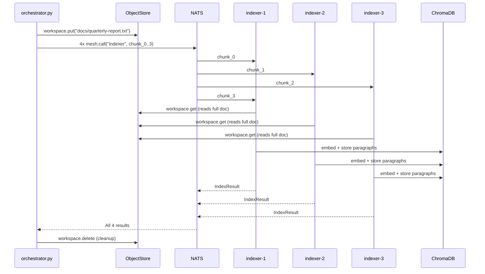

# Parallel RAG Indexing with ObjectStore

Multiple indexer agents split a large document into chunks and index them in parallel. The source document lives in the mesh ObjectStore, so any agent can access it without shared filesystems or S3 configuration. ChromaDB stores the resulting embeddings locally.

This recipe shows two mesh primitives working together: **ObjectStore** for shared binary artifacts, and **queue groups** for automatic parallelization of the indexing workload.

## Dependencies

```bash
pip install chromadb sentence-transformers
```

## Models

```python
from pydantic import BaseModel

class IndexRequest(BaseModel):
    workspace_key: str  # ObjectStore key for the source document
    chunk_index: int
    chunk_count: int

class IndexResult(BaseModel):
    chunk_index: int
    num_embeddings: int
    collection: str
```

## Indexer Agent

Each instance receives a chunk assignment, reads the source document from the ObjectStore, extracts its assigned portion, and writes embeddings to ChromaDB:

```python
import chromadb
from sentence_transformers import SentenceTransformer
from openagentmesh import AgentMesh, AgentSpec

mesh = AgentMesh()
embedder = SentenceTransformer("all-MiniLM-L6-v2")
chroma = chromadb.Client()

spec = AgentSpec(
    name="indexer",
    channel="rag",
    description="Indexes a chunk of a document into ChromaDB. Input: ObjectStore key, chunk index, total chunks.",
)

@mesh.agent(spec)
async def index_chunk(req: IndexRequest) -> IndexResult:
    # Read the full document from the mesh ObjectStore
    doc_bytes = await mesh.workspace.get(req.workspace_key)
    text = doc_bytes.decode("utf-8")

    # Split into paragraphs and select this agent's portion
    paragraphs = [p.strip() for p in text.split("\n\n") if p.strip()]
    chunk_size = max(1, len(paragraphs) // req.chunk_count)
    start = req.chunk_index * chunk_size
    end = start + chunk_size if req.chunk_index < req.chunk_count - 1 else len(paragraphs)
    my_paragraphs = paragraphs[start:end]

    if not my_paragraphs:
        return IndexResult(chunk_index=req.chunk_index, num_embeddings=0, collection=req.workspace_key)

    # Embed and store
    embeddings = embedder.encode(my_paragraphs).tolist()
    collection = chroma.get_or_create_collection(name="docs")
    collection.add(
        documents=my_paragraphs,
        embeddings=embeddings,
        ids=[f"{req.workspace_key}-{req.chunk_index}-{i}" for i in range(len(my_paragraphs))],
    )

    return IndexResult(
        chunk_index=req.chunk_index,
        num_embeddings=len(my_paragraphs),
        collection="docs",
    )

mesh.run()
```

## Orchestrator

Uploads the document to the ObjectStore, then fans out indexing requests. Queue groups distribute the work across however many indexer instances are running:

```python
import asyncio
from pathlib import Path
from openagentmesh import AgentMesh

CHUNK_COUNT = 4

async def main():
    mesh = AgentMesh()
    async with mesh:
        # Upload document to the mesh ObjectStore
        doc = Path("large-document.txt").read_bytes()
        await mesh.workspace.put("docs/quarterly-report.txt", doc)

        # Fan out indexing across available indexer instances
        tasks = [
            mesh.call("indexer", {
                "workspace_key": "docs/quarterly-report.txt",
                "chunk_index": i,
                "chunk_count": CHUNK_COUNT,
            })
            for i in range(CHUNK_COUNT)
        ]
        results = await asyncio.gather(*tasks)

        total = sum(r["num_embeddings"] for r in results)
        print(f"Indexed {total} paragraphs across {CHUNK_COUNT} chunks")

        # Cleanup
        await mesh.workspace.delete("docs/quarterly-report.txt")

asyncio.run(main())
```

## Run It

```bash
# Terminal 1
oam mesh up

# Terminals 2-4: multiple indexer instances (queue group auto-balances)
python indexer.py
python indexer.py
python indexer.py

# Terminal 5
python orchestrator.py
```

Output:

```
Indexed 47 paragraphs across 4 chunks
```

With three indexer instances and four chunks, NATS distributes the four `mesh.call` requests across instances. One instance handles two chunks; the others handle one each.

## How It Works



Key properties:

- **ObjectStore as shared filesystem.** The orchestrator uploads once; every indexer reads from the same ObjectStore key. No shared mounts or cloud storage credentials.
- **Scaling is additive.** More indexer instances means the four requests distribute across more workers. The orchestrator code doesn't change.
- **ChromaDB is local.** Each indexer writes to its own ChromaDB client. For production, point all instances at a shared Chroma server or use a persistent directory.
- **Chunk strategy is pluggable.** This recipe splits by paragraph count. Swap in token-based or semantic chunking without touching the mesh wiring.
