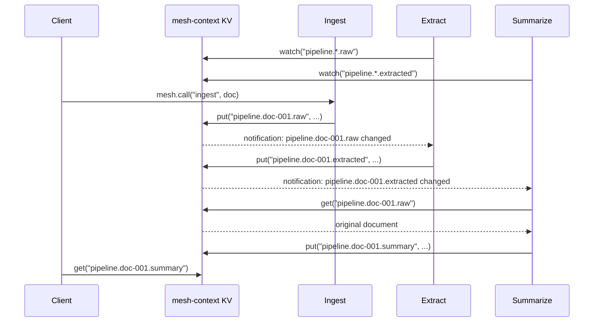

# Reactive Pipeline

A three-stage pipeline where each stage watches for its input to appear, does its work, and writes the result for the next stage. No orchestrator dispatches work. No agent calls another agent. Coordination happens through the data.

This recipe demonstrates `mesh.kv.watch()` as a coordination primitive: agents react to state changes instead of being told what to do.

## The Code

```python
--8<-- "src/openagentmesh/demos/reactive_pipeline.py"
```

## Run It

```bash
oam demo run reactive_pipeline
```

## How It Works

```
[ingest] --writes--> KV:"pipeline.{id}.raw"
                        |
               [extract] watches, writes --> KV:"pipeline.{id}.extracted"
                                                  |
                                           [summarize] watches, writes --> KV:"pipeline.{id}.summary"
```

Each stage is independent. Start them in any order. Drop one and the pipeline pauses at that stage. Add it back and it picks up where it left off.



Key properties:

- **No orchestrator.** No central process decides what runs when. Each stage watches for its input and reacts. The pipeline emerges from the data flow.
- **Order-independent startup.** Start the stages in any order. Watchers that start before data exists simply wait. Watchers that start after data was written receive the current value immediately.
- **Stage independence.** Kill the summarize stage midway. Ingest and extract continue producing. Restart summarize and it picks up the unprocessed extracted results.
- **Parallel pipelines.** Submit ten documents. Each flows through the pipeline independently. Stages process whichever document update arrives next.
- **Observable state.** Every intermediate result is a KV entry. Debugging is reading keys, not tracing RPC chains.
- **Visible participants.** All three stages are registered agents. They appear in `mesh.catalog()`, participate in liveness tracking, and can be filtered with `mesh.catalog(invocable=True)` when selecting tools for LLM invocation.

!!! tip "Dot-separated keys for wildcard watching"
    KV keys use `.` as the hierarchy separator (not `/`) because NATS subject matching treats `.` as a token delimiter. This enables `watch("pipeline.*.raw")` to match any document ID in the middle.

!!! tip "Scaling expensive processing"
    Watcher agents run as a single instance; every replica receives every KV update. If the processing step is expensive, split the watcher into a thin routing layer that calls an invocable agent via `mesh.call()`. The invocable agent scales via queue groups:

    ```python
    @mesh.agent(AgentSpec(name="extract-watcher", channel="pipeline",
        description="Routes raw documents to the extract processor."))
    async def extract_watcher():
        async for value in mesh.kv.watch("pipeline.*.raw"):
            doc = Document.model_validate_json(value)
            await mesh.call("extract-processor", {"id": doc.id, "body": doc.body})
    ```
