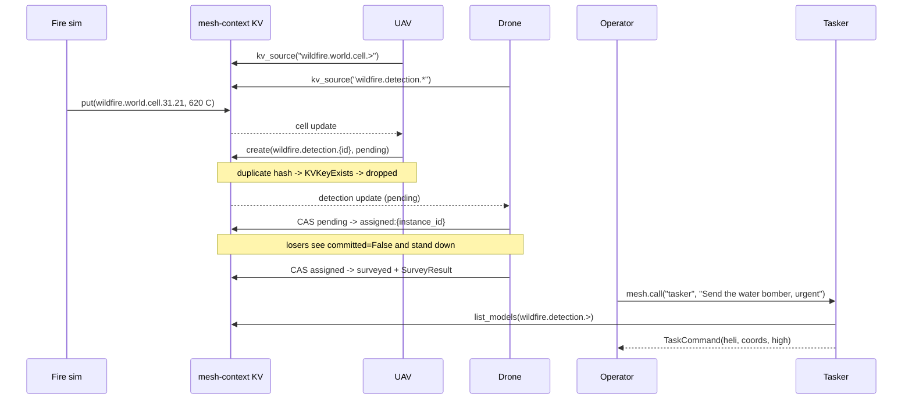

# Wildfire Incident Response

Coordinate an emergency-response swarm over the mesh. A fire simulator writes world state to KV, a high-altitude UAV turns hot cells into detection records, survey drones elect themselves onto pending detections with no leader, and an LLM tasker translates operator language into typed dispatch commands. Nobody orchestrates the cascade: it emerges from three coordination patterns.

1. **KV-driven detection.** A `kv_source` handler watches a KV namespace and uses `mesh.kv.create()` (put-if-absent) as the dedup primitive.
2. **Leaderless task election.** Drones race a CAS on the detection record; winning the write *is* winning the job.
3. **LLM peer as a plain typed agent.** Natural language in, Pydantic-validated command out, callable via `mesh.call()` from anywhere on the mesh.

This recipe distills those patterns from the full demo in `demos/wildfire/`.

## The Contracts

All state lives in the shared `mesh-context` KV bucket under `wildfire.*` keys. Every record is a Pydantic model, so a malformed write fails at the boundary, not three agents downstream.

```python
import asyncio
import hashlib
import time
from typing import Literal

from pydantic import BaseModel, Field

from openagentmesh import AgentMesh, AgentSpec, KVEntry, KVKeyExists


class Coords(BaseModel):
    x: float = Field(ge=-5.0, le=5.0)  # km from HQ at the origin
    y: float = Field(ge=-5.0, le=5.0)


class CellState(BaseModel):
    """KV value at wildfire.world.cell.<x_idx>.<y_idx> (200 m grid)."""
    coords: Coords
    temperature: float  # degrees Celsius


class SurveyResult(BaseModel):
    surveyor_instance_id: str
    fire_visible: bool
    persons_detected: int


class DetectionRecord(BaseModel):
    """KV value at wildfire.detection.{detection_id}.

    Lifecycle: pending -> assigned:{instance_id} -> surveyed.
    """
    detection_id: str
    state: str
    coords: Coords
    severity: float  # 0..1, derived from temperature
    survey: SurveyResult | None = None


class TaskRequest(BaseModel):
    operator_id: str
    text: str  # natural language from the operator


class TaskCommand(BaseModel):
    target_fleet: Literal["heli", "ffunit", "medevac"]
    coords: Coords
    priority: Literal["low", "med", "high"]
    persons_estimated: int = 0
    rationale: str  # one line, for the audit log
```

## Pattern 1: KV-Driven Detection (UAV)

The UAV never polls and is never called. Binding `mesh.kv_source()` to the agent fires the handler on every cell update; `on_init="replay"` re-fires the current snapshot at startup, so a restarted UAV re-checks the whole world without extra code.

Deduplication needs no coordinator either: detections in the same 100 m bucket within the same 30 s window hash to the same ID, and `mesh.kv.create()` refuses to overwrite an existing key. The collision **is** the dedup mechanism.

```python
TEMP_THRESHOLD_C = 100.0


def dedup_id(coords: Coords, now: float) -> str:
    """One detection per 100 m grid bucket per 30 s window."""
    bucket = f"{round(coords.x / 0.1)}:{round(coords.y / 0.1)}:{int(now // 30)}"
    return hashlib.sha1(bucket.encode()).hexdigest()[:16]


def build_uav(mesh: AgentMesh) -> None:
    @mesh.agent(
        AgentSpec(
            name="high-alt.uav",
            description="High-altitude thermal observer; writes pending "
                        "detections from world-cell updates.",
        ),
        sources=[mesh.kv_source("wildfire.world.cell.>", on_init="replay")],
    )
    async def uav(entry: KVEntry[CellState]) -> None:
        if entry.operation == "DELETE":
            return  # cell cooled back to ambient; detections are not retracted

        cell = entry.value
        if cell.temperature <= TEMP_THRESHOLD_C:
            return

        detection_id = dedup_id(cell.coords, time.time())
        record = DetectionRecord(
            detection_id=detection_id,
            state="pending",
            coords=cell.coords,
            severity=min(1.0, (cell.temperature - 100.0) / 700.0),
        )
        try:
            await mesh.kv.create(f"wildfire.detection.{detection_id}", record)
        except KVKeyExists:
            pass  # this area was already reported in this window: dedup done
```

!!! tip "`>` vs `*` in source patterns"
    Cell keys carry two trailing segments (`.<x_idx>.<y_idx>`), so the pattern must use `>` (one or more segments). `wildfire.world.cell.*` matches exactly one segment and would never fire.

## Pattern 2: Leaderless Task Election (Drone)

Every drone sees every new detection. Instead of a dispatcher assigning work, each drone attempts a single compare-and-swap on the record: `pending -> assigned:{instance_id}`. Exactly one CAS commits; the losers return without error. `try_cas_model()` treats losing the race as data (`committed == False`), not as an exception.

```python
def build_drone(mesh: AgentMesh) -> None:
    @mesh.agent(
        AgentSpec(
            name="low-alt.drone",
            description="Low-altitude survey drone; CAS-elects itself on "
                        "pending detections and writes the survey result.",
        ),
        sources=[mesh.kv_source("wildfire.detection.*", on_init="replay")],
    )
    async def drone(entry: KVEntry[DetectionRecord]) -> None:
        if entry.operation == "DELETE":
            return
        rec = entry.value
        if rec.state != "pending":
            return

        key = f"wildfire.detection.{rec.detection_id}"

        # Election: one CAS attempt. Losing the race is data, not an error.
        async with mesh.kv.try_cas_model(key, DetectionRecord) as claim:
            if claim.value.state != "pending":
                return  # claimed between the event and our read
            claim.value.state = f"assigned:{mesh.instance_id}"
        if not claim.committed:
            return  # another drone won

        await asyncio.sleep(0.1)  # simulate travel + sensor sweep

        async with mesh.kv.try_cas_model(key, DetectionRecord) as done:
            done.value.state = "surveyed"
            done.value.survey = SurveyResult(
                surveyor_instance_id=mesh.instance_id,
                fire_visible=True,
                persons_detected=0,
            )
```

Run five copies of this process and they load-balance themselves: the closest free drone usually wins because it attempts the CAS first, and ties resolve atomically in KV. No queue groups, no scheduler, no lock service.

!!! note "Crashed claimants"
    An `assigned:{instance_id}` record whose claimant dies would stall forever. The full demo runs a watchdog that CAS-flips detections back to `pending` when the assignment outlives the claimant's heartbeat; a sibling drone then re-elects itself and the cascade self-heals (see `demos/wildfire/fleet/briefer.py`).

## Pattern 3: An LLM Peer Is a Plain Typed Agent (Tasker)

The tasker is a Responder like any other: `TaskRequest` in, `TaskCommand` out. That it happens to run an LLM inside the handler is invisible to the mesh; callers get the same typed contract, discovery, and validation as every other agent. Anything on the mesh can invoke it: another agent, a CLI, or a browser through the TypeScript SDK.

```python
def build_tasker(mesh: AgentMesh) -> None:
    @mesh.agent(AgentSpec(
        name="tasker",
        description="Translates an operator's natural-language request into "
                    "one typed TaskCommand. Do NOT use it to execute or "
                    "dispatch anything: it only translates.",
    ))
    async def tasker(req: TaskRequest) -> TaskCommand:
        # Ground in live mesh state: target the newest surveyed detection.
        detections = await mesh.kv.list_models(
            "wildfire.detection.>", DetectionRecord,
        )
        surveyed = [e.value for e in detections if e.value.state == "surveyed"]
        target = surveyed[-1].coords if surveyed else Coords(x=0.0, y=0.0)

        # Stand-in for one structured LLM call (see below).
        text = req.text.lower()
        wants_extraction = "person" in text or "extract" in text
        return TaskCommand(
            target_fleet="medevac" if wants_extraction else "heli",
            coords=target,
            priority="high" if ("urgent" in text or "now" in text) else "med",
            rationale=f"Translated from operator {req.operator_id} request.",
        )
```

!!! note
    The recipe simulates the LLM with keyword routing so it runs offline. The full demo makes exactly one structured call per request, with the output schema pinned via forced tool use and Pydantic as the final gate: a hallucinated `target_fleet="hovercraft"` fails validation instead of reaching a fleet.

    ```python
    from anthropic import AsyncAnthropic

    client = AsyncAnthropic()

    resp = await client.messages.create(
        model="claude-sonnet-4-6",
        max_tokens=1024,
        system=SYSTEM_PROMPT,
        messages=[{"role": "user", "content": grounding_json}],
        tools=[{
            "name": "emit_taskcommand",
            "description": "Emit the TaskCommand result.",
            "input_schema": TaskCommand.model_json_schema(),
        }],
        tool_choice={"type": "tool", "name": "emit_taskcommand"},
    )
    command = TaskCommand.model_validate(resp.content[0].input)
    ```

## The Cascade

Wire the three agents together and ignite a cell. No agent calls another agent until the operator speaks; everything up to `surveyed` is reactive.

```python
async def main(mesh: AgentMesh) -> None:
    build_uav(mesh)
    build_drone(mesh)
    build_tasker(mesh)
    await mesh.catalog()      # flush registrations: KV sources bind, agents go live
    await asyncio.sleep(0.1)  # let the watchers attach

    # Ignite: write one burning cell. Nobody dispatches anything.
    await mesh.kv.put_model(
        "wildfire.world.cell.31.21",
        CellState(coords=Coords(x=1.2, y=-0.8), temperature=620.0),
    )

    # Watch the detection record walk its lifecycle.
    async def until_surveyed() -> DetectionRecord:
        async for value in mesh.kv.watch("wildfire.detection.*"):
            rec = DetectionRecord.model_validate_json(value)
            print(f"detection {rec.detection_id}: {rec.state}")
            if rec.state == "surveyed":
                return rec

    rec = await asyncio.wait_for(until_surveyed(), timeout=10.0)
    print(f"survey: fire_visible={rec.survey.fire_visible}")

    # Operator speaks; the mesh answers with a typed, validated command.
    result = await mesh.call(
        "tasker",
        TaskRequest(operator_id="op-1", text="Send the water bomber, urgent"),
    )
    command = TaskCommand.model_validate(result)
    print(f"dispatch: {command.target_fleet} -> "
          f"({command.coords.x}, {command.coords.y}) [{command.priority}]")
```

## Run It

```python
import asyncio
from openagentmesh import AgentMesh

async def run():
    async with AgentMesh.local() as mesh:
        await main(mesh)

asyncio.run(run())
```

## How It Works



Key properties:

- **State is the API.** Agents coordinate through typed KV records, not point-to-point calls. Kill any agent and restart it; `on_init="replay"` rebuilds its view from the current snapshot.
- **Two primitives, two problems.** `create()` (put-if-absent) answers "has anyone reported this yet?"; CAS answers "who owns this work?". Both resolve races in the bus, with no lock service.
- **The lifecycle is auditable.** `pending -> assigned:{instance_id} -> surveyed` lives in one KV record. Debugging a stuck detection is reading one key.
- **LLMs are peers, not infrastructure.** The tasker registers a contract like every other agent. Swapping the model, or replacing it with rules, changes nothing for its callers.

## Run the Full Demo

The complete package adds a procedural fire simulator, five drone processes, action fleets (heli, ffunit, medevac), an LLM briefer and narrator, chaos kills, and a watchdog:

```bash
uv run python -m demos.wildfire --seed 42
```

The seed pins the terrain, and each boot wipes the previous run's JetStream state, so every run starts from the same clean world. Two UIs come up with it:

- **Scenario UI** (`http://127.0.0.1:8081`): tactical map with live fire spread, fleet sprites and trails, incident briefings, mission log, and narrator pane. Double-click terrain to ignite a fire; click a unit to kill its process and watch the swarm self-heal.
- **Admin UI** (`http://127.0.0.1:8088`): the mesh's own view: agent registry with liveness, live event feed, and a contract sandbox where you can call the tasker in natural language from the browser and watch the typed `TaskCommand` come back.

Export `ANTHROPIC_API_KEY` first if you want real briefings and translations; without it every LLM surface degrades to an honest typed error. The full source is in `demos/wildfire/` (agents in `fleet/`, world simulation in `world/`, contracts and keys in `core/`).
