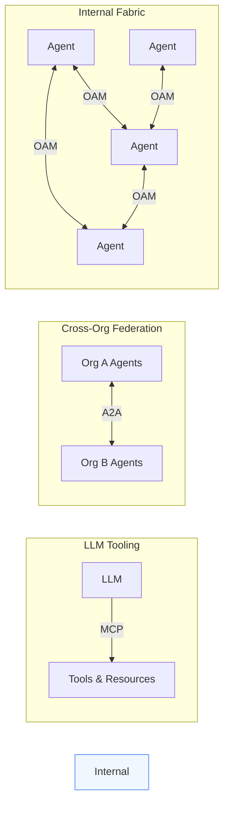

# The Multi-Agent Landscape

## The problem

Multi-agent systems today are **tightly coupled**. Adding a new agent means updating every caller that needs to know about it. Remove an agent, and consumers break silently. Scale to multiple teams, and coordination becomes the bottleneck.

```python
# This is how most multi-agent systems work today
from team_a import summarizer
from team_b import translator
from team_c import sentiment_analyzer

# Every consumer hardcodes every dependency.
# New agent? Change every file. Agent removed? Runtime crash.
result = await summarizer.invoke(text)
```

This doesn't scale past a single team.

## The landscape

Two protocols have emerged to address parts of this problem:

**MCP (Model Context Protocol)** connects LLMs to tools. It's the standard for giving a model access to external capabilities: file systems, APIs, databases. MCP is LLM-to-tool.

**A2A (Agent-to-Agent)** is Google's protocol for cross-organization agent federation. It defines how agents from different companies discover and invoke each other over HTTP. A2A is org-to-org.

Neither addresses what happens **inside** an organization, where dozens or hundreds of agents need to discover and invoke each other at runtime without direct coupling.

## The gap



There's no **LAN of agents**, no internal discovery fabric where agents register themselves, publish typed contracts, and find each other at runtime without any caller knowing about any provider in advance.

## How OAM fills this

OpenAgentMesh is the missing layer: a NATS-based protocol for agent-to-agent communication within an organization.

```python
from openagentmesh import AgentMesh

mesh = AgentMesh("nats://mesh.company.com:4222")

# No imports from other teams. No hardcoded dependencies.
# Discover what's available right now.
catalog = await mesh.catalog(channel="nlp")

# Call an agent by name. The mesh handles routing.
result = await mesh.call("summarizer", {"text": doc, "max_length": 200})
```

What this gives you:

- **Runtime discovery**: agents register on startup, deregister on shutdown. Consumers discover what's available right now, not what was available at deploy time.
- **Typed contracts**: every agent publishes input/output JSON Schemas via Pydantic v2. Validation happens automatically at the mesh boundary.
- **Zero coupling**: adding a new agent requires zero changes to existing code. Any consumer can discover and invoke it immediately.
- **NATS as shared bus**: a single infrastructure component provides pub/sub, request/reply, load balancing (queue groups), and a KV store for the registry. No separate service registry, message queue, or load balancer.

## The service mesh analogy

If you've worked with Istio, Linkerd, or MuleSoft, the pattern will feel familiar. OAM applies the **service mesh** concept, proven in enterprise infrastructure, to AI agent architectures.

A service mesh gives microservices discovery, load balancing, and observability without each service knowing about the network topology. OAM does the same for agents, with one difference: routing is based on **semantic understanding** (what the agent does, what it accepts) rather than network-level rules.

!!! info "One architecture, not two modes"
    The same agent code runs against a local NATS server during development and a multi-region cluster in production. The only thing that changes is the connection string: `AgentMesh()` becomes `AgentMesh("nats://mesh.company.com:4222")`.

For a deeper look at the technology choices, see [Technology Stack](../learn/technology.md).
